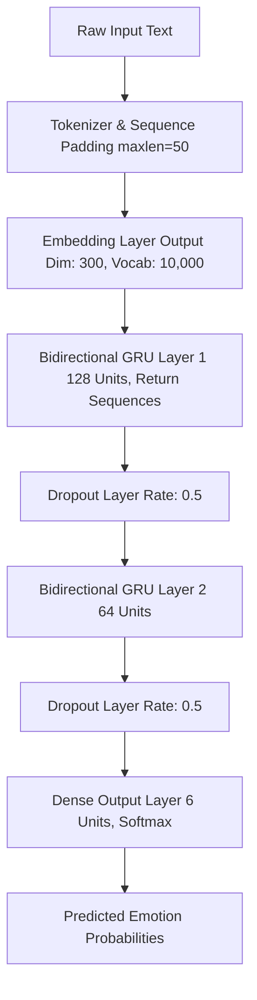

# 🎭 EmotionIQ: Text Emotion Classification with Bidirectional GRU

[](https://www.python.org/)
[](https://www.tensorflow.org/)
[](https://fastapi.tiangolo.com/)
[](https://huggingface.co/datasets/dair-ai/emotion)
[](https://railway.com/)
[](LICENSE)

An end-to-end Deep Learning project for multi-class textual emotion recognition. This repository features comprehensive benchmarking across **Simple RNN**, **LSTM**, **GRU**, **Bidirectional LSTM**, and an optimized **Bidirectional GRU (BiGRU)** champion architecture — served as a production-ready **FastAPI** web application and deployed on **Railway**.

---

## 🌐 Live Demo

> **The application is live and hosted on Railway.**
>
> 🔗 **[https://emotioniq-production.up.railway.app](https://emotioniq-production.up.railway.app)**
>
> Open the link, type any sentence, and get an instant emotion prediction — no setup required!

---

## 📌 Overview

Understanding emotional context in textual data is essential for sentiment analysis, user feedback analysis, and conversational AI. **EmotionIQ** classifies input text into six distinct emotional categories using deep recurrent neural networks trained on the benchmark `dair-ai/emotion` dataset.

### 🏷️ Target Emotion Classes

| Index | Emotion Class | Emoji | Description / Example Expression |
| :---: | :---: | :---: | :--- |
| `0` | **Sadness** | 😢 | *"I am feeling so low and tired today."* |
| `1` | **Joy** | 😄 | *"I really enjoyed the movie, it was fantastic!"* |
| `2` | **Love** | ❤️ | *"I feel so blessed and grateful for my family."* |
| `3` | **Anger** | 😠 | *"I am frustrated with the terrible customer service."* |
| `4` | **Fear** | 😨 | *"I was terrified during the thunderstorm."* |
| `5` | **Surprise** | 😲 | *"I was shocked to see them win the race!"* |

---

## 🚀 Key Features

- **Production Web Application:** Full-stack FastAPI backend with a beautiful static frontend, deployed on Railway.
- **Multi-Model Architectural Comparison:** Evaluates performance across Simple RNN, Standard LSTM, Standard GRU, BiLSTM, and BiGRU.
- **Robust Preprocessing Pipeline:** Keras `Tokenizer` (vocab size: 10,000) with sequence padding & truncation (`maxlen=50`).
- **Class Imbalance Mitigation:** Computes dynamic balanced class weights (`sklearn.utils.class_weight`) during loss computation to handle skewed class distributions.
- **Overfitting Protection:** Incorporates `Dropout(0.5)` layers and `EarlyStopping` monitoring validation loss with `restore_best_weights=True`.
- **REST API with Swagger Docs:** Interactive API documentation available at `/docs` on the deployed URL.
- **Production Artifacts:** Pre-trained model and fitted tokenizer stored in the `Artifacts/` directory, ready for instant inference.

---

## 🛠️ Tech Stack

| Layer | Technology |
| :--- | :--- |
| **Deep Learning Framework** | TensorFlow / Keras |
| **Backend API** | FastAPI + Uvicorn |
| **Frontend** | HTML / CSS / JS (static, served by FastAPI) |
| **Deployment** | Railway (Nixpacks builder) |
| **Dataset** | Hugging Face `dair-ai/emotion` |
| **Language** | Python 3.8+ |

---

## 🧠 Champion Model Architecture (Bidirectional GRU)

The Bidirectional GRU architecture captures contextual representations by processing sequences in both forward and backward directions simultaneously.



### Layer Breakdown

| Layer Type | Output Shape | Parameters / Details |
| :--- | :--- | :--- |
| **Embedding** | `(Batch, 50, 300)` | Input dim: 10,000, Output dim: 300, Input length: 50 |
| **Bidirectional (GRU)** | `(Batch, 50, 256)` | 128 units × 2 directions (`return_sequences=True`) |
| **Dropout** | `(Batch, 50, 256)` | Dropout rate = 0.5 |
| **Bidirectional (GRU)** | `(Batch, 64)` | 64 units × 2 directions |
| **Dropout** | `(Batch, 64)` | Dropout rate = 0.5 |
| **Dense (Output)** | `(Batch, 6)` | 6 units with `softmax` activation |

---

## 📂 Repository Structure

```text
.
├── Artifacts/
│   ├── BiGru_model.keras             # Trained Bidirectional GRU model (Keras format)
│   └── tokenizer.pkl                 # Pickle-serialized Keras Tokenizer
├── static/
│   └── index.html                    # Frontend UI served at the root endpoint
├── main.py                           # FastAPI application (API endpoints & model serving)
├── Emotion_Classification.ipynb      # End-to-end Jupyter notebook (EDA, training & evaluation)
├── railway.json                      # Railway deployment configuration (Nixpacks)
├── render.yaml                       # Render deployment configuration (alternative)
├── requirements.txt                  # Python dependencies
├── .gitignore                        # Git ignore rules
└── README.md                         # Project documentation (this file)
```

---

## 🌍 Deployment on Railway

EmotionIQ is deployed on **[Railway](https://railway.com/)** using the **Nixpacks** builder. Railway automatically detects the project configuration from `railway.json`.

### Railway Configuration (`railway.json`)

```json
{
  "$schema": "https://railway.com/railway.schema.json",
  "build": {
    "builder": "NIXPACKS",
    "buildCommand": "python -m pip install --upgrade pip && pip install -r requirements.txt"
  },
  "deploy": {
    "startCommand": "uvicorn main:app --host 0.0.0.0 --port $PORT",
    "restartPolicyType": "ON_FAILURE",
    "restartPolicyMaxRetries": 10
  }
}
```

### How It Works

1. **Build Phase:** Railway uses Nixpacks to create the runtime environment, installs Python dependencies from `requirements.txt`.
2. **Deploy Phase:** Launches the FastAPI app via `uvicorn`, binding to `0.0.0.0` on the Railway-assigned `$PORT`.
3. **Auto-Restart:** On failure, Railway will automatically restart the service (up to 10 retries).
4. **Static Frontend:** The `index.html` in `static/` is served at the root (`/`) endpoint by FastAPI.

### Deploy Your Own Instance

1. Fork this repository.
2. Create a new project on [Railway](https://railway.com/).
3. Connect your GitHub repository.
4. Railway will auto-detect `railway.json` and deploy — no additional configuration needed.

---

## 📡 API Endpoints

| Method | Endpoint | Description |
| :---: | :--- | :--- |
| `GET` | `/` | Serves the frontend UI |
| `GET` | `/health` | Health check — returns server status and model load state |
| `POST` | `/predict` | Predicts emotion for the given text input |
| `GET` | `/docs` | Interactive Swagger API documentation (auto-generated by FastAPI) |

### Example: `/predict` Request

```bash
curl -X POST "https://emotioniq-production.up.railway.app/predict" \
  -H "Content-Type: application/json" \
  -d '{"text": "I really enjoyed the movie, the storyline was brilliant!"}'
```

### Example Response

```json
{
  "text": "I really enjoyed the movie, the storyline was brilliant!",
  "predicted_emotion": "joy",
  "confidence": 0.9876,
  "all_probabilites": {
    "sadness": 0.0012,
    "joy": 0.9876,
    "love": 0.0054,
    "anger": 0.0008,
    "fear": 0.0032,
    "surprise": 0.0018
  }
}
```

---

## 💻 Local Development Setup

### 1. Clone & Navigate to Repository

```bash
git clone https://github.com/kanojiyaved/EmotionIQ.git
cd EmotionIQ
```

### 2. Create Virtual Environment

- **Windows (PowerShell):**
  ```powershell
  python -m venv .venv
  .\.venv\Scripts\Activate.ps1
  ```
- **macOS / Linux:**
  ```bash
  python3 -m venv .venv
  source .venv/bin/activate
  ```

### 3. Install Dependencies

```bash
pip install --upgrade pip
pip install -r requirements.txt
```

### 4. Run the Application Locally

```bash
python main.py
```

The server will start at `http://localhost:8000`. Open it in your browser to use the EmotionIQ UI.

---

## ⚡ Quick Start: Programmatic Inference

You can also run predictions directly in Python using the saved model artifacts without the web server:

```python
import pickle
import numpy as np
from tensorflow import keras
from tensorflow.keras.preprocessing.sequence import pad_sequences

# 1. Load saved model and tokenizer
model = keras.models.load_model('Artifacts/BiGru_model.keras')
with open('Artifacts/tokenizer.pkl', 'rb') as f:
    tokenizer = pickle.load(f)

# 2. Define Emotion Class Labels
label_names = ['sadness', 'joy', 'love', 'anger', 'fear', 'surprise']

# 3. Input Text Samples
sample_texts = [
    "I really enjoyed the movie, the storyline was brilliant!",
    "I was shocked and terrified by the unexpected news.",
    "I am feeling so down and lonely today."
]

# 4. Preprocess Input
sequences = tokenizer.texts_to_sequences(sample_texts)
padded_seqs = pad_sequences(sequences, maxlen=50, padding='post', truncating='post')

# 5. Predict & Output Results
predictions = model.predict(padded_seqs)
predicted_indices = np.argmax(predictions, axis=1)

for text, idx in zip(sample_texts, predicted_indices):
    print(f"Text:       {text}")
    print(f"Emotion:    {label_names[idx]}\n")
```

---

## 📊 Dataset & Training Methodology

- **Dataset Source:** `dair-ai/emotion` from Hugging Face Datasets.
  - **Train split:** 16,000 samples
  - **Validation split:** 2,000 samples
  - **Test split:** 2,000 samples
- **Optimizer:** `Adam`
- **Loss Function:** `sparse_categorical_crossentropy`
- **Callbacks:** `EarlyStopping(monitor='val_loss', patience=3, restore_best_weights=True)`

---

## 🔮 Future Enhancements

- [ ] Integrate Transformer architectures (BERT, RoBERTa, DistilBERT) for comparison.
- [x] ~~Build an interactive UI demo using **Gradio** or **Streamlit**.~~ → Built a custom FastAPI + static HTML frontend.
- [ ] Containerize model inference service using **Docker**.
- [x] ~~Deploy to cloud platform.~~ → Deployed on **Railway**.

---

## 📄 License & Acknowledgments

Distributed under the **MIT License**. Dataset credit belongs to [dair-ai/emotion](https://huggingface.co/datasets/dair-ai/emotion).
