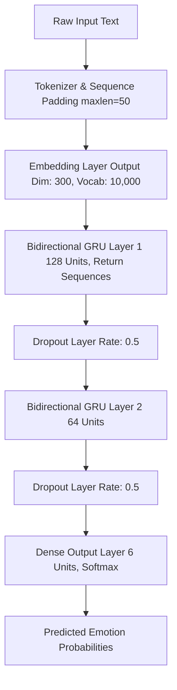

# 🎭 EmotionIQ: Text Emotion Classification with Bidirectional GRU

[](https://www.python.org/)
[](https://www.tensorflow.org/)
[](https://huggingface.co/datasets/dair-ai/emotion)
[](LICENSE)

An end-to-end Deep Learning project for multi-class textual emotion recognition. This repository features comprehensive benchmarking across **Simple RNN**, **LSTM**, **GRU**, **Bidirectional LSTM**, and an optimized **Bidirectional GRU (BiGRU)** champion architecture.

---

## 📌 Overview

Understanding emotional context in textual data is essential for sentiment analysis, user feedback analysis, and conversational AI. **EmotionIQ** classifies input text into six distinct emotional categories using deep recurrent neural networks trained on the benchmark `dair-ai/emotion` dataset.

### 🏷️ Target Emotion Classes

| Index | Emotion Class | Description / Example Expression |
| :---: | :---: | :--- |
| `0` | **Sadness** | *"I am feeling so low and tired today."* |
| `1` | **Joy** | *"I really enjoyed the movie, it was fantastic!"* |
| `2` | **Love** | *"I feel so blessed and grateful for my family."* |
| `3` | **Anger** | *"I am frustrated with the terrible customer service."* |
| `4` | **Fear** | *"I was terrified during the thunderstorm."* |
| `5` | **Surprise** | *"I was shocked to see them win the race!"* |

---

## 🚀 Key Features

- **Multi-Model Architectural Comparison:** Evaluates performance across Simple RNN, Standard LSTM, Standard GRU, BiLSTM, and BiGRU.
- **Robust Preprocessing Pipeline:** Keras `Tokenizer` (vocab size: 10,000) with sequence padding & truncation (`maxlen=50`).
- **Class Imbalance Mitigation:** Computes dynamic balanced class weights (`sklearn.utils.class_weight`) during loss computation to handle skewed class distributions.
- **Overfitting Protection:** Incorporates `Dropout(0.5)` layers and `EarlyStopping` monitoring validation loss with `restore_best_weights=True`.
- **Production Artifacts:** Pre-trained model ([BiGru_model.keras](file:///d:/Vedant%20kanojiya/PROJECTS/DL%20Project/BiGru_model.keras)) and fitted tokenizer ([tokenizer.pkl](file:///d:/Vedant%20kanojiya/PROJECTS/DL%20Project/tokenizer.pkl)) ready for instant inference.

---

## 🧠 Champion Model Architecture (Bidirectional GRU)

The Bidirectional GRU architecture captures contextual representations by processing sequences in both forward and backward directions simultaneously.



### Layer Breakdown

| Layer Type | Output Shape | Parameters / Details |
| :--- | :--- | :--- |
| **Embedding** | `(Batch, 50, 300)` | Input dim: 10,000, Output dim: 300, Input length: 50 |
| **Bidirectional (GRU)** | `(Batch, 50, 256)` | 128 units x 2 directions (`return_sequences=True`) |
| **Dropout** | `(Batch, 50, 256)` | Dropout rate = 0.5 |
| **Bidirectional (GRU)** | `(Batch, 64)` | 64 units x 2 directions |
| **Dropout** | `(Batch, 64)` | Dropout rate = 0.5 |
| **Dense (Output)** | `(Batch, 6)` | 6 units with `softmax` activation |

---

## 📂 Repository Structure

```text
.
├── BiGru_model.keras             # Trained Bidirectional GRU model (Keras format)
├── tokenizer.pkl                 # Pickle serialized Keras Tokenizer
├── Emotion_Classification.ipynb  # End-to-end Jupyter notebook (EDA, training & evaluation)
├── requirements.txt              # Project dependencies list
└── README.md                     # Project documentation
```

Key file links:
- Notebook: [Emotion_Classification.ipynb](file:///d:/Vedant%20kanojiya/PROJECTS/DL%20Project/Emotion_Classification.ipynb)
- Model file: [BiGru_model.keras](file:///d:/Vedant%20kanojiya/PROJECTS/DL%20Project/BiGru_model.keras)
- Tokenizer: [tokenizer.pkl](file:///d:/Vedant%20kanojiya/PROJECTS/DL%20Project/tokenizer.pkl)
- Dependencies: [requirements.txt](file:///d:/Vedant%20kanojiya/PROJECTS/DL%20Project/requirements.txt)

---

## 💻 Environment Setup & Installation

### 1. Clone & Navigate to Repository

```bash
git clone https://github.com/kanojiyaved/EmotionIQ.git
cd EmotionIQ
```

### 2. Create Virtual Environment

- **Windows (PowerShell):**
  ```powershell
  python -m venv .venv
  \.venv\Scripts\Activate.ps1
  ```
- **macOS / Linux:**
  ```bash
  python3 -m venv .venv
  source .venv/bin/activate
  ```

### 3. Install Dependencies

```bash
pip install --upgrade pip
pip install -r requirements.txt
```

---

## ⚡ Quick Start & Inference

You can run predictions on custom sentences using the saved artifact model and tokenizer without retraining:

```python
import pickle
import numpy as np
from tensorflow import keras
from tensorflow.keras.preprocessing.sequence import pad_sequences

# 1. Load saved model and tokenizer
model = keras.models.load_model('BiGru_model.keras')
with open('tokenizer.pkl', 'rb') as f:
    tokenizer = pickle.load(f)

# 2. Define Emotion Class Labels
label_names = ['sadness', 'joy', 'love', 'anger', 'fear', 'surprise']

# 3. Input Text Samples
sample_texts = [
    "I really enjoyed the movie, the storyline was brilliant!",
    "I was shocked and terrified by the unexpected news.",
    "I am feeling so down and lonely today."
]

# 4. Preprocess Input
sequences = tokenizer.texts_to_sequences(sample_texts)
padded_seqs = pad_sequences(sequences, maxlen=50, padding='post', truncating='post')

# 5. Predict & Output Results
predictions = model.predict(padded_seqs)
predicted_indices = np.argmax(predictions, axis=1)

for text, idx in zip(sample_texts, predicted_indices):
    print(f"Text:       {text}")
    print(f"Emotion:    {label_names[idx]}\n")
```

---

## 📊 Dataset & Training Methodology

- **Dataset Source:** `dair-ai/emotion` from Hugging Face Datasets.
  - **Train split:** 16,000 samples
  - **Validation split:** 2,000 samples
  - **Test split:** 2,000 samples
- **Optimizer:** `Adam`
- **Loss Function:** `sparse_categorical_crossentropy`
- **Callbacks:** `EarlyStopping(monitor='val_loss', patience=3, restore_best_weights=True)`

---

## 🔮 Future Enhancements

- [ ] Integrate Transformer architectures (BERT, RoBERTa, DistilBERT) for comparison.
- [ ] Build an interactive UI demo using **Gradio** or **Streamlit**.
- [ ] Containerize model inference service using **Docker** & **FastAPI**.

---

## 📄 License & Acknowledgments

Distributed under the **MIT License**. Dataset credit belongs to [dair-ai/emotion](https://huggingface.co/datasets/dair-ai/emotion).

